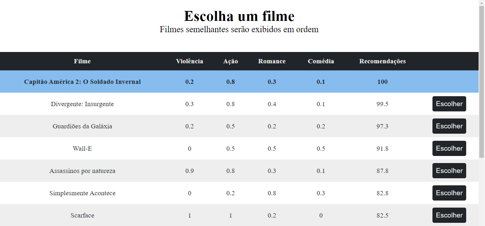

# KNN em javascript
Modelo lógico de um KNN em Javascript desenvolvido para a aula de Inteligência artificial.

De forma simplificada um KNN é um algoritmo de inteligência artificial que permite a classificação de itens com base na proximidade entre os vizinhos mais próximos.

Neste desafio, precisávamos elaborar uma forma do usuário escolher um filme com notas de Violência, Ação, Romance e Comédia e o sistema retornasse em ordem uma série de filmes com as características mais próximas, algo similar ao que a Netflix realiza quando assistimos filmes de um tipo e vários outros filmes com doses de violência, ação e comédia similares são recomendados.

Para executar o script basta baixar os arquivos e abrir o arquivo "index.html" no navegador.
